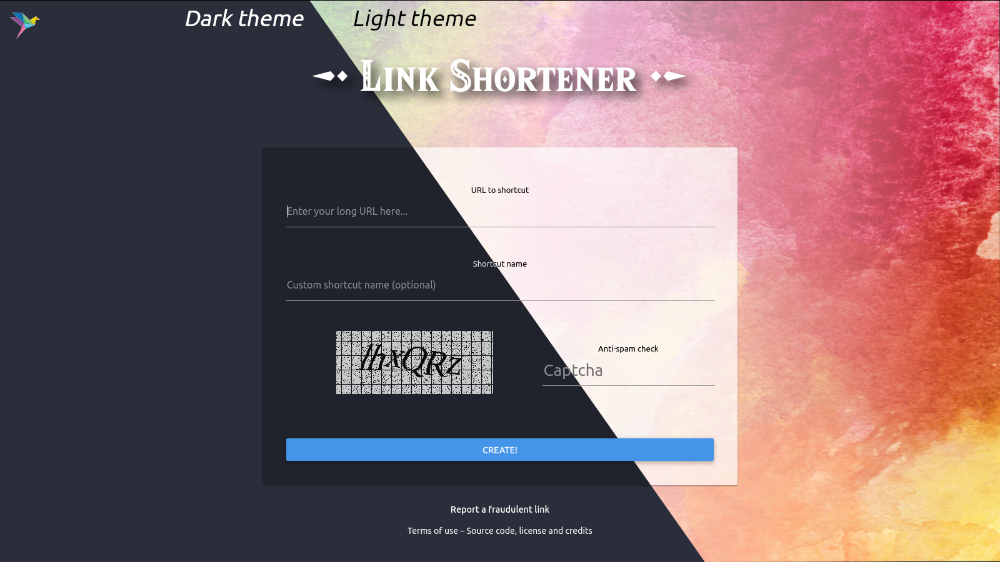
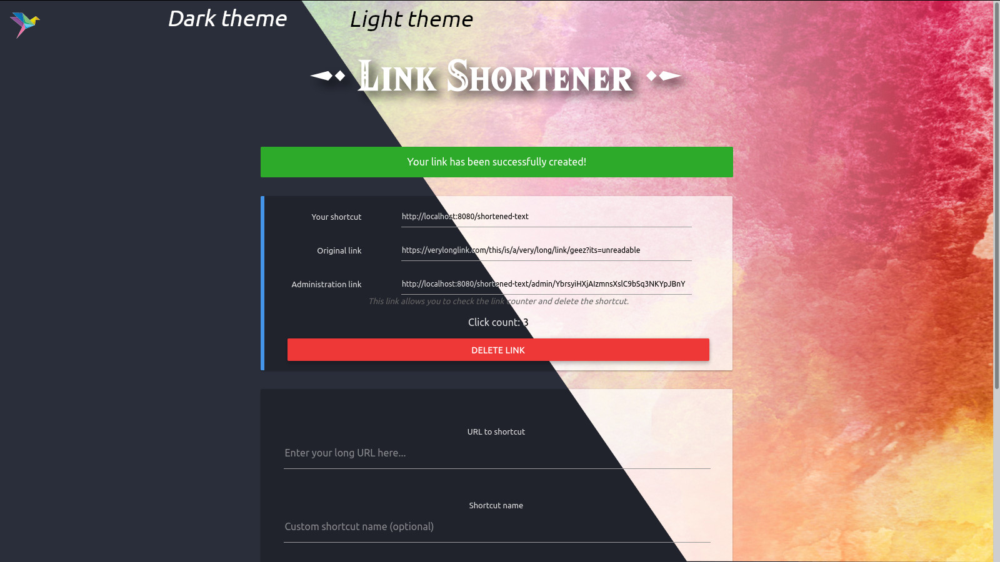
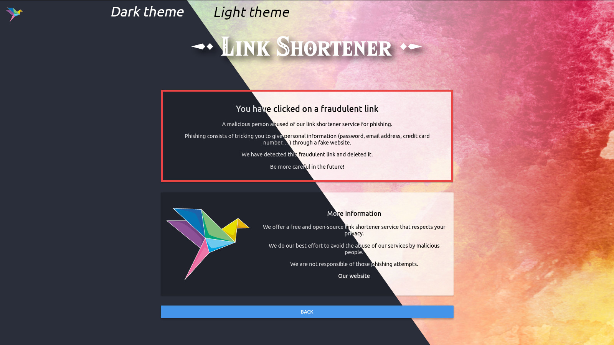

# rs-short

Link shortener in Rust.

Developed to be as minimal and lightweight as possible.

Powered by the [Actix](https://actix.rs) framework using (server-side) [Askama](https://github.com/djc/askama) templates.

- Around 1000 lines of code, including 20% of comments
- Consumes between 5MB and 20MB of RAM
- No JS, no CSS framework
- No tracking features, user IPs are not saved in database
- No `unsafe` block
- Compiles on Rust stable

Features:
- Includes a captcha as a minimal protection against spamming
- Easily customizable assets, contact details and hoster information
- Light / dark theme
- Only needs a SQLite database to work
- Robust caching features to serve content even with database locks
- Localization (available in French, English and Occitan, please translate!)
- Basic protection against spambots (captcha with a customizable difficulty)
- Active **detection of phishing links** (detects "suspicious activity")
- Counting clicks
- Allows shortcut deletion by the user
- Allows marking a shortcut as "phishing", which displays a awareness-raising message to victims
- Blocks URL with regexes, includes a default blocklist

**Official instance:** https://s.42l.fr/

## Screenshots

Main page:



Admin page for users when they create a link:



Page displayed when a link is marked as phishing by the server administrator:



## Running an instance

First, you must install Cargo and the latest stable version of Rust by following the instructions on [this website](https://rustup.rs/). Alternatively, you can use the [liuchong/rustup](https://hub.docker.com/r/liuchong/rustup) Docker image.

- Clone the project:

```bash
git clone https://git.42l.fr/42l/rs-short.git
```

- Edit what you need. You might want to change the following files:
    - `assets/hoster-logo.svg`: replace with the logo of your organization
    - `assets/logo.svg`: the software logo
    - `assets/themes/light/background.jpg`: the default background for the light theme

- Copy `config.toml.sample` to `config.toml` and edit its values to suit your needs:
    - **Important**: Replace default values of `cookie_key` and `phishing_password`.

- Edit the policy lists in `lists.toml` at your convenience.

You can configure a `fail2ban` instance and watch your favourite reverse-proxy logs to see which IPs are getting a 403 Forbidden and ban accordingly for the duration of your choice.

- `cargo run --release`

To integrate the service with a **systemd** or **nginx** configuration, please check [the wiki](https://git.42l.fr/42l/rs-short/wiki/Integration-with-nginx-%2F-systemd).

## Contributing

Here are many ways to contribute:
- Translate!
    - Add your entries in the `lang.json` file.
    - Once you're done, edit `init.rs` and add your language in the ValidLanguages structure.
- Add some more CSS themes
- Rework default themes' CSS (they've gone a bit messy since then. hopefully they are commented)
- Develop a more resilient protection to spambots
    - Add JS? :(
- Add a toggle to disable the captcha
- Experiment around captchas to match accessibility needs. I have no idea... :(

This software is mainly developed and maintained by [Neil](https://shelter.moe/@Neil) for the [Association 42l](https://42l.fr). 

If you like the work done on this project, please consider to [donate or join](https://42l.fr/Support-us) the association. Thank you!

## Graphical credits

- Link Shortener logo by [Brume](https://shelter.moe/@Brume).
- Link Shortener logo font is Hylia Serif by [Artsy Omni](http://artsyomni.com/hyliaserif).
- Default background by [Love-Kay on deviantart](https://www.deviantart.com/love-kay/art/Abstract-Colorful-Watercolor-Texture-438376516).
- Website font by [Ubuntu](https://design.ubuntu.com/font/)
